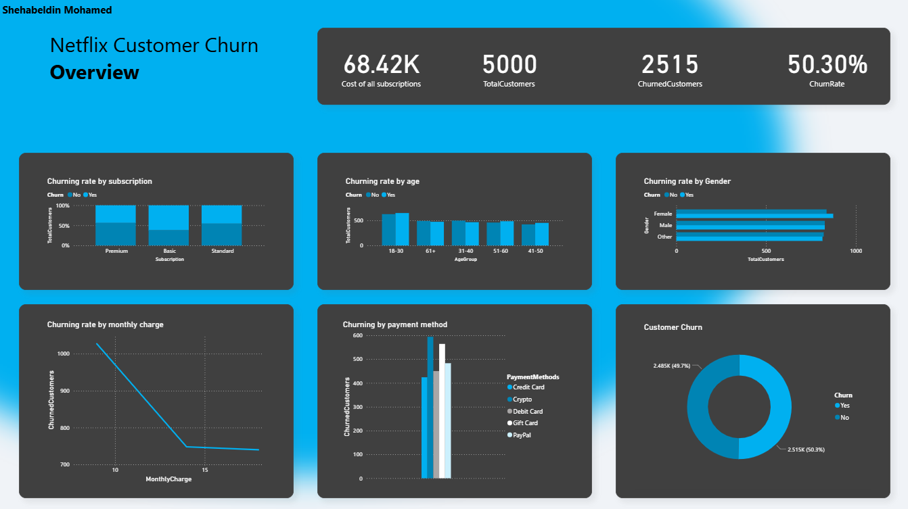

# Netflix Customer Churn Dashboard 📊

This project analyzes customer churn behavior based on this data from [Kaggle](https://www.kaggle.com/datasets/abdulwadood11220/netflix-customer-churn-dataset/data). The dashboard was built using Power BI and explores patterns related to subscription type, payment methods, age, and gender.

## 🔍 Objective
To identify key insights behind why customers are churning and help stakeholders improve customer retention strategies.

## 📸 Preview

## 🛠️ Tools Used
- Power BI
- CSV Dataset from Kaggle
- DAX for calculated columns & measures

## 📈 Dashboard Highlights
- Churn rate overview
- Breakdown by gender, age group, subscription type, and payment method
- Cost of subscriptions vs. churn

## 📂 Folder Contents
- `NetflixCustomerChurn.pbix`: Power BI file
- `NetflixCustomerChurn.pdf`: PDF export of the dashboard
- `Dashboard.png`: PNG image of the dashboard
- `Dataset/`: Source dataset

## 🧠 Key Insights
- ~50% of customers have churned.
- Highest churn among 18–30 age group.
- Basic plan users show higher churn than Premium or Standard.
---

Feel free to open the `.pbix` file in Power BI Desktop to explore the interactive dashboard.

## 📄 Data Source & License

The dataset used in this project is available on [Kaggle](https://www.kaggle.com/datasets/abdulwadood11220/netflix-customer-churn-dataset/data) and is licensed under the [Creative Commons Attribution-ShareAlike 4.0 International (CC BY-SA 4.0)](https://creativecommons.org/licenses/by-sa/4.0/).

**Dataset Title**: Netflix Customer Churn Dataset  
**Author**: [Abdul Wadood](https://www.kaggle.com/abdulwadood11220)  
**License**: CC BY-SA 4.0

