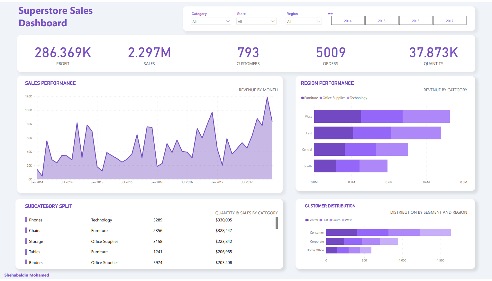

# SuperStore Sales Dashboard 📊

This project analyzes sales data from the SuperStore dataset, which is widely used for educational and demo purposes in tools like Tableau and Power BI. The dashboard provides insights into regional and category-level sales performance to support data-driven decisions.

---

## 🔍 Objective

To explore SuperStore's sales data in depth and uncover actionable insights related to customer segments, product categories, profit margins, and regional performance.

---

## 📸 Preview

---

## 🛠️ Tools Used

- Microsoft Excel (for initial data cleaning)
- SQL Server Management Studio (SSMS)
- Power BI
- SQL (to create a star schema using fact and dimension views)

---

## 🧹 Data Preparation

- Cleaned the dataset in **Excel** (handled missing values, corrected types, standardized entries).
- Imported the cleaned dataset into **SQL Server**.
- Designed and built a **star schema**, including:
  - **Fact Table**: `FactSales`
  - **Dimension Tables**: `DimCustomer`, `DimProduct`, `DimRegion`, `DimOrder`

---

## 📈 Dashboard Highlights

- Sales and profit analysis by segment, region, and category
- Discount impact analysis
- Customer distribution across market segments
- Product performance breakdown

---

## 📂 Folder Contents

- `SuperStoreDashboard.pbix` – Main Power BI dashboard
- `Dashboard.png` – Image preview of the dashboard
- `Dataset/` – Contains:
  - `raw/` – Original dataset (as downloaded)
  - `clean/` – Cleaned version used for SQL import
- `SQL_Schema/` – SQL scripts for fact and dimension views

---

## 🧠 Key Insights

- **Consumer** segment dominates customer base in all regions.
- **West** and **East** regions contribute the highest sales volume.
- Some categories (e.g., Tables, Binders) show low profit despite high sales.
- Discounts often correlate with lower profitability in specific sub-categories.

---

## 📄 Data Source & Disclaimer

The dataset used in this project is available on [Kaggle](https://www.kaggle.com/datasets/vivek468/superstore-dataset-final/data) and was originally shared by a user who included the following disclaimer:

> **"I do not own this data. I merely found it from the Tableau website. All credits to the original authors/creators. For educational purposes only."**

This project is also created **for educational purposes only**. I do not claim ownership of the dataset.

If you are the data owner and would like this dataset or project removed or modified, please reach out via an issue or message.

---

Feel free to open the `.pbix` file in **Power BI Desktop** to explore the interactive dashboard.
